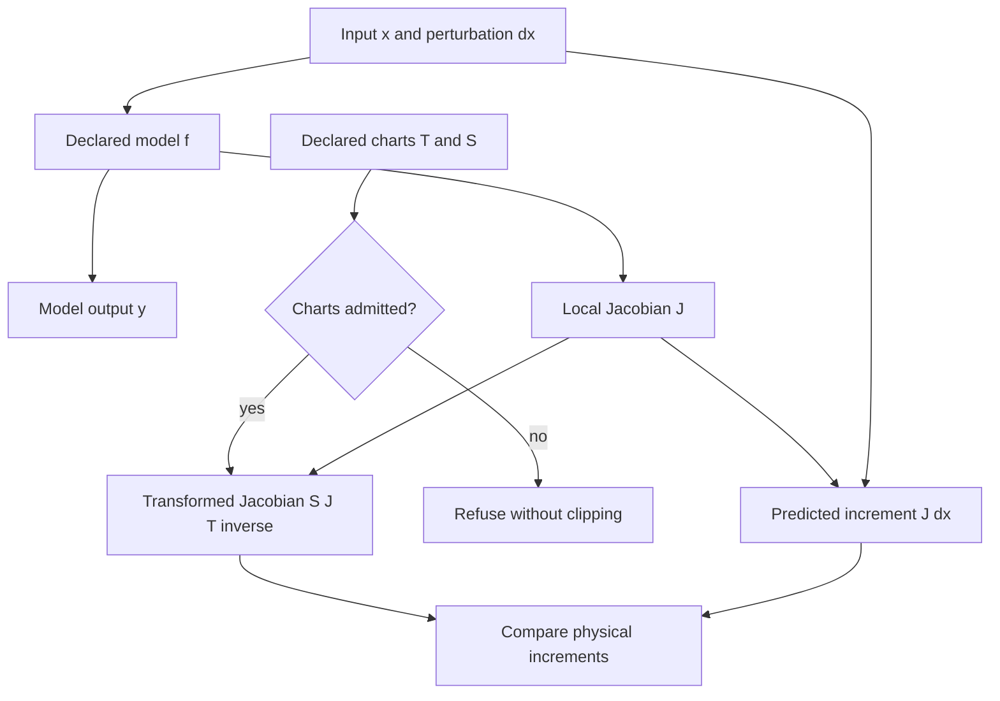

# Sensitivity

**Measure how input changes affect model outputs, derivatives and propagated uncertainty.**

| NET micro-tool | Identity and scope |
| --- | --- |
| User-facing name | **Sensitivity** |
| Proposed NET operation family | `math.sensitivity` |
| Implementation repository | `Jacobian-Sensitivity-Testbed` |
| Existing provider and import | Jacobian and Sensitivity Propagation Testbed / JSPT; `sensitivity` |
| Existing covariance operation | `jspt.covariance-propagate.v1` via `sensitivity.ciw_adapter` |
| Current boundary | Local first-order derivatives, explicit compositions, coordinate consistency and covariance propagation |

`math.sensitivity` is the friendly discovery/operation-family target. It does
**not** rename the versioned covariance endpoint or establish a new installed
alias. Use the library APIs and runnable subprocess example below. The covariance
endpoint accepts a supplied Jacobian; accepting that matrix is not derivative
verification. Local sensitivity is not a global nonlinear guarantee.

NET owns session composition and dispatch; this provider owns derivative and
covariance mathematics. Evidence, operation specifications, execution attempts
and verification records remain distinct. Package imports, versioned contracts,
retained artifacts and licence terms are unchanged. The older repository URL
`Jacobian-Sensitivity-Propagation-Testbed` is historical; the checkout commands
below use the current repository name.

Part of **Notation Systems Inc's computational instrumentation and evidence infrastructure** for industrial and cyber-physical systems.

[Notations Engineering Terminal (CIW)](https://github.com/giasonpooni/Notations-Engineering-Terminal) · [Stack map](https://github.com/giasonpooni/Notations-Engineering-Terminal/blob/main/docs/STACK.md) · [Component role and interfaces](docs/STACK_ROLE.md)

A computational testbed for propagating local perturbations through
composed scientific models, with derivative verification,
coordinate-consistency tests, and explicit numerical limitations.

Short name **JSPT**. The reusable library import is `sensitivity`.

The project answers more than "what is the Jacobian of this function?"
Its central question is:

> How do changes in inputs and parameters propagate through this
> model—and does that answer remain consistent when we compose or
> re-express the model?

## Organization

**Notation Systems Inc** is the parent organization.

| Division | Focus |
| --- | --- |
| **Notations Gaming** | Games, graphics and interactive worlds. |
| **Notations Manufacturing** | Industrial design, materials and manufacturing systems. |
| **Notations Laboratories** | Research, scientific computing, simulation and experimental validation. |

This repository contributes sensitivity and uncertainty propagation tools to **Notations Laboratories**, supporting modeling and validation across the divisions.

## Map



Solid arrows summarize implemented model and coordinate-consistency APIs. Raw Jacobian entries are not invariants: the perturbation and output must move with the declared invertible charts. This model-based diagram is distinct from the covariance endpoint below, which accepts a supplied Jacobian and does not verify that derivative.

[Instrumentation diagram atlas](https://github.com/giasonpooni/Notations-Engineering-Terminal/blob/main/docs/DIAGRAMS.md).

## What is in the first release

| Responsibility | What the testbed demonstrates |
| --- | --- |
| Derivative checking | Compare a declared Jacobian with central, forward, or complex-step estimates. |
| Composition | Verify that stepwise chain-rule propagation agrees with differentiating the composed map. |
| Coordinate consistency | Transform the model and the perturbation together, then compare physical predictions. |
| Local-validity testing | Measure where `dy ~ J dx` stops describing `f(x+dx)-f(x)`. |
| Correlated uncertainty | Reuse the same Jacobian in `Sigma_y ~ J Sigma_x J^T` and compare with Monte Carlo. |

The coordinate test is the structural distinction. For invertible linear
maps `x' = T x` and `y' = S y`,

```text
J' = S J T^{-1}.
```

We do **not** expect raw Jacobian entries or unscaled singular values to
be invariant under a change of units. We do expect

```text
J' dx' = S (J dx)
```

after the perturbation has been translated. Sensitivity scores that use
matrix norms must declare a scaling.

## Install and run

Python 3.12 or 3.13 and NumPy are required. [uv](https://docs.astral.sh/uv/)
is the supported runner; a plain virtual environment also works.

```bash
git clone https://github.com/giasonpooni/Jacobian-Sensitivity-Testbed.git
cd Jacobian-Sensitivity-Testbed
uv run --python 3.13 python examples/quickstart.py
uv run --python 3.13 --with pytest pytest -q
```

Without uv:

```bash
python3 -m venv .venv
source .venv/bin/activate
pip install -e . pytest
PYTHONPATH=src python examples/quickstart.py
PYTHONPATH=src pytest -q
```

The quickstart writes `results/quickstart.md`.

## Using the library

The `sensitivity` package accepts declared models and arrays. Applications can
use `jacobian_at`, `first_order_covariance`, and `push_covariance` without
adopting the experiment suite or changing their domain types.

See [docs/KERNEL.md](docs/KERNEL.md) for the API and numerical constraints.

### Workbench covariance operation

The JSON endpoint `sensitivity.ciw_adapter` exposes
`jspt.covariance-propagate.v1` as an **operation provider**. It accepts a
content-addressed `covariance-artifact.v1` plus an explicit, ordered Jacobian
and returns the full propagated covariance with source, basis, unit, frame,
and linearization-point declarations. Weighted aggregation retains all
cross-covariances; invertible coordinate changes retain the existing chart
condition and round-trip checks.

```bash
PYTHONPATH=src python -m sensitivity.ciw_adapter < examples/covariance_request.json
```

The included shared-offset example returns mean variance `1.03`: the shared
variance `1` remains, while independent reading variance `0.09` is divided
among three readings. Negative weights can legitimately cancel a shared
component. The endpoint uses the existing covariance kernels; it neither
computes a derivative from the supplied matrix nor performs a nonlinear
Monte Carlo comparison. Notations Engineering Terminal's existing CIW runtime
may bind a specific clean Git revision as a pinned subprocess; JSPT retains
scientific ownership. The `sensitivity.ciw_adapter` module and versioned
operation identifiers are unchanged by the workbench title update.

See [docs/CIW_ADAPTER.md](docs/CIW_ADAPTER.md) for the exact transport,
artifact contract, refusal meanings, and validation evidence.

## Library layout

```text
Reusable sensitivity core
        +
Reference models and derivative checks
        +
Perturbation / covariance experiments
        +
Coordinate-equivalence tests
        +
Reproducible reports
```

```text
from sensitivity import (
    compose,
    jacobian_at,
    jvp,
    check_composition,
    check_coordinate_consistency,
    check_derivative,
    sweep_perturbation_scale,
)
```

Existing fluid, construction, and observer projects can consume
`sensitivity` where that removes duplication. They do not need the
experiment suite.

## Scope and limits

First-order, local, explicit compositions only. Global sensitivity,
discontinuous mode changes, and trajectory sensitivities are unsupported.

First-order covariance is exact for affine maps. For nonlinear maps the
testbed reports the Monte Carlo gap instead of treating the formula as
unconditionally adequate.

See [docs/SCOPE.md](docs/SCOPE.md) and [docs/METHODS.md](docs/METHODS.md).

## License

MIT. See [LICENSE](LICENSE).
