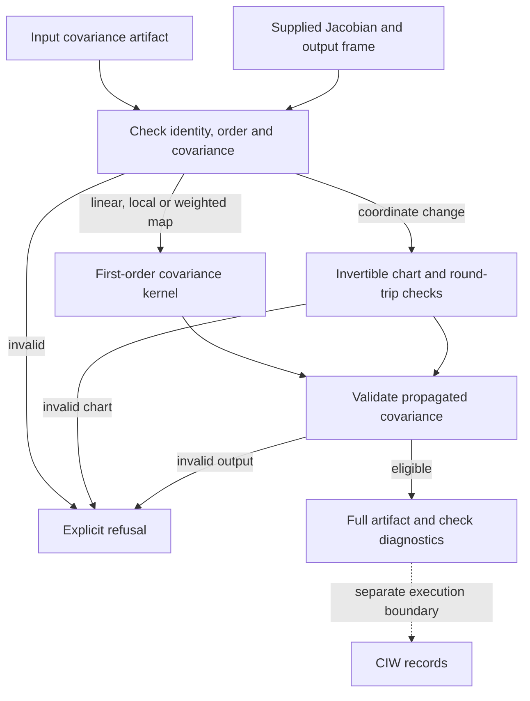

# Jacobian Sensitivity Propagation Testbed in the instrumentation stack

Notation Systems develops computational instrumentation and evidence infrastructure for industrial and cyber-physical systems.
This component owns **local derivatives, sensitivity and covariance transport**. The [stack map](https://github.com/atomtrapping/Notations-Systems-Terminal/blob/main/docs/STACK.md) locates all public components and distinguishes implemented paths from specifications and scaffolds.

## Current boundary

| Property | Scope |
| --- | --- |
| Implementation | Executable numerical testbed |
| Workbench connection | Pinned covariance propagation provider |
| Inputs | Declared differentiable maps or supplied Jacobians, perturbations, coordinate maps and ordered covariance. |
| Outputs | Derivative checks, propagated perturbations/covariance, coordinate-consistency diagnostics and local-validity experiments. |

First-order propagation is conditional on the supplied model, linearization and uncertainty. A covariance operation does not independently verify the supplied Jacobian.

## Covariance provider boundary

Solid arrows show the implemented JSON provider; dotted arrows mark CIW ownership. Jacobian columns follow input quantities and rows follow output quantities. Frames, units, basis IDs, reference values, correlations and provenance remain explicit in the artifacts. The provider does not infer unit conversions, establish physical frame validity or verify the caller-supplied derivative. Model-based Monte Carlo comparisons remain separate APIs.

[Instrumentation diagram atlas](https://github.com/atomtrapping/Notations-Systems-Terminal/blob/main/docs/DIAGRAMS.md).

## Interoperability

Integrations use the component's documented contract and an explicit adapter. They preserve source observations, ordered quantities, units, coordinate/frame meaning, time semantics, missingness and declared uncertainty where applicable. An unimplemented field or conversion must be reported as unsupported rather than silently inferred.

Evidence identity names the source record; operation identity names the versioned computation; execution identity names an invocation; result identity names its output; verification identity names a scoped check. These are integration requirements, not a claim that every standalone repository already implements all five record types.

Display names and repository locations do not rename packages, schemas, operation IDs, retained corpus keys or historical runtime pins. CIW integrations use the exact source revisions named in its runtime manifests and operating guides; a provider's current default branch is not a substitute for that binding. Published numerical records retain their original run scope.

## Technical references

- [Overview and runnable instructions](../README.md)
- [docs/CIW_ADAPTER.md](CIW_ADAPTER.md)
- [docs/METHODS.md](METHODS.md)
- [docs/SCOPE.md](SCOPE.md)

Private customer state, deployment configuration and calibration knowledge are outside this public component description. Applicable repository licenses and source-data rights remain controlling; a shared stack identity is not a license grant or a change of repository visibility.
